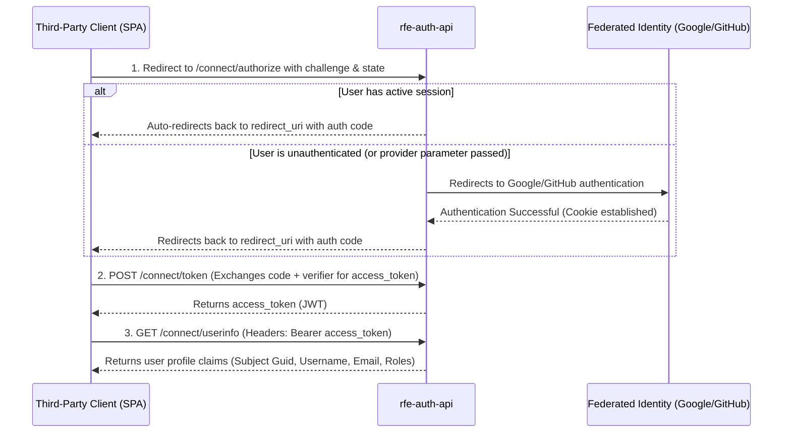

# RFE Auth Integration Guide (USAGE.md)

This document provides clear instructions for developer integration of third-party consumer applications with the **rfe-auth** identity provider (IdP) service.

---

## 🚀 1. Overview of the Authentication Flow

`rfe-auth` supports the standard **OAuth 2.1 / OpenID Connect (OIDC)** protocol. 
For public client applications (such as Single Page Applications in React, Vue, or Angular), you **MUST** use the **Authorization Code Flow with PKCE (Proof Key for Code Exchange)**.



---

## 🛠️ 2. Step 1: Initiate Authorization Request

Your application initiates the flow by redirecting the user to `rfe-auth`'s authorization endpoint:

### Request URL
`GET https://localhost:5001/connect/authorize`

### Query Parameters

| Parameter | Required | Description |
| :--- | :--- | :--- |
| `client_id` | **Yes** | Your registered client identifier (e.g., `rfe-glam-app`). |
| `response_type` | **Yes** | Value must be `code`. |
| `redirect_uri` | **Yes** | The callback URL in your application. Must match registered redirect URIs. |
| `scope` | **Yes** | Must include `openid profile email`. |
| `code_challenge` | **Yes** | Base64url-encoded SHA-256 hash of your PKCE `code_verifier`. |
| `code_challenge_method`| **Yes** | Value must be `S256`. |
| `state` | **Yes** | A random string to prevent CSRF. Additionally, specify desired user roles here (e.g., `Laborer` or `Employer`) if auto-registering new federated logins. |
| `provider` | No | Pass `Google` or `GitHub` to directly challenge the federated provider and bypass the local login UI. |

### Example JavaScript/TypeScript Snippet:
```typescript
// 1. Generate code verifier & challenge
const verifier = generateCodeVerifier(); // Cryptographically random string (43-128 chars)
sessionStorage.setItem('pkce_verifier', verifier);

const challenge = await generateCodeChallenge(verifier); // SHA-256 hashed & base64url encoded

// 2. Build authorization URL
const authUrl = new URL("https://localhost:5001/connect/authorize");
authUrl.searchParams.append("client_id", "rfe-glam-app");
authUrl.searchParams.append("response_type", "code");
authUrl.searchParams.append("redirect_uri", "https://localhost:5173/oauth-callback");
authUrl.searchParams.append("scope", "openid profile email");
authUrl.searchParams.append("code_challenge", challenge);
authUrl.searchParams.append("code_challenge_method", "S256");
authUrl.searchParams.append("state", "Laborer"); // Desired role for federated logins
authUrl.searchParams.append("provider", "Google"); // Directly launch Google Sign-In

// 3. Redirect the browser
window.location.href = authUrl.toString();
```

---

## 🔑 3. Step 2: Exchange Code for Access Token

Upon successful user authentication, `rfe-auth` redirects the browser back to your `redirect_uri` with `code` and `state` query parameters:
`https://localhost:5173/oauth-callback?code=AUTH_CODE_HERE&state=Laborer`

Extract the `code` and send a `POST` request to the token endpoint to exchange it for an access token.

### Request URL
`POST https://localhost:5001/connect/token`

### Headers
`Content-Type: application/x-www-form-urlencoded`

### Request Body (Form URL Encoded)

| Parameter | Required | Description |
| :--- | :--- | :--- |
| `grant_type` | **Yes** | Value must be `authorization_code`. |
| `client_id` | **Yes** | Your registered client ID (e.g., `rfe-glam-app`). |
| `code` | **Yes** | The authorization code received in the redirect. |
| `redirect_uri` | **Yes** | Must match the `redirect_uri` used in Step 1. |
| `code_verifier` | **Yes** | The raw plaintext `code_verifier` stored in `sessionStorage`. |

### Example JavaScript/TypeScript Snippet:
```typescript
const code = new URLSearchParams(window.location.search).get("code");
const verifier = sessionStorage.getItem("pkce_verifier");

const body = new URLSearchParams();
body.append("grant_type", "authorization_code");
body.append("client_id", "rfe-glam-app");
body.append("code", code);
body.append("redirect_uri", "https://localhost:5173/oauth-callback");
body.append("code_verifier", verifier);

const response = await fetch("https://localhost:5001/connect/token", {
    method: "POST",
    headers: {
        "Content-Type": "application/x-www-form-urlencoded"
    },
    body: body
});

const tokens = await response.json();
// {
//   "access_token": "eyJhbGciOiJSU0Et...",
//   "token_type": "Bearer",
//   "expires_in": 3600
// }
```

---

## 👤 4. Step 3: Fetch User Information

Use the returned `access_token` to retrieve the authenticated user's profile and roles.

### Request URL
`GET https://localhost:5001/connect/userinfo` or `POST https://localhost:5001/connect/userinfo`

### Headers
`Authorization: Bearer <access_token>`

### Example Response (JSON)
```json
{
  "sub": "019f6f97-2aac-7d56-8f18-5ef4b66ef7dc",
  "name": "developer@rfe.com",
  "email": "developer@rfe.com",
  "roles": [
    "Laborer"
  ]
}
```

* **`sub`**: The persistent, unique Guid identifier of the user inside the identity database. This is guaranteed to be a valid Guid string.
* **`name`**: The user's username (typically their email).
* **`email`**: The verified email address of the user.
* **`roles`**: An array of local system roles assigned to this user (e.g. `Laborer`, `Employer`, `Admin`).

---

## 🔒 5. Direct API Endpoints Protecting

For backend APIs, you can authorize incoming requests by forwarding the client's access token to the `/connect/userinfo` endpoint. If `/connect/userinfo` returns a `200 OK` response, the token is verified and active, and you can map the returned user details (`sub`, `roles`) into your API claims context.
